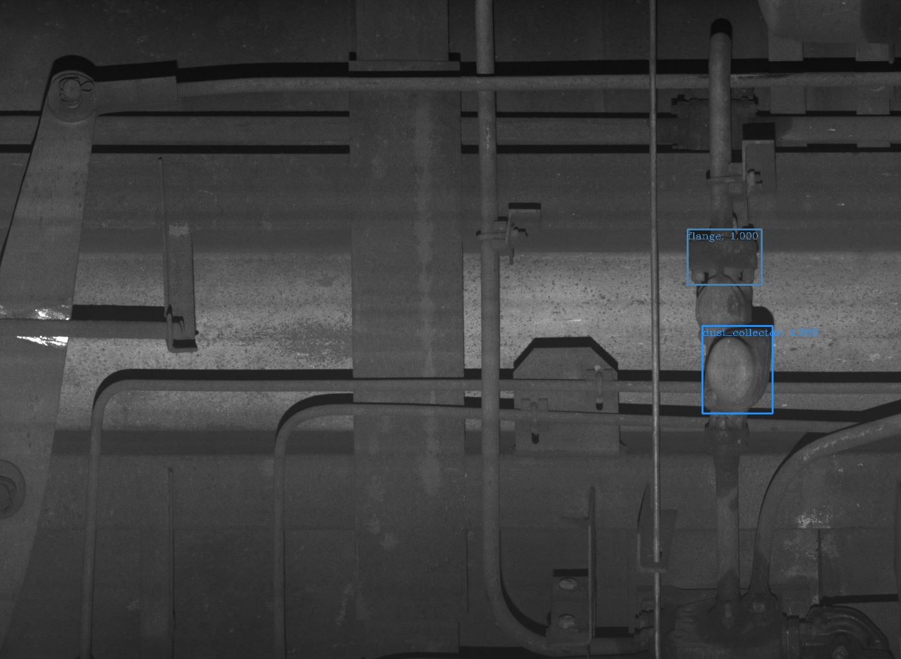
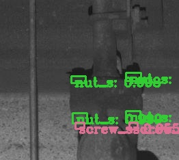
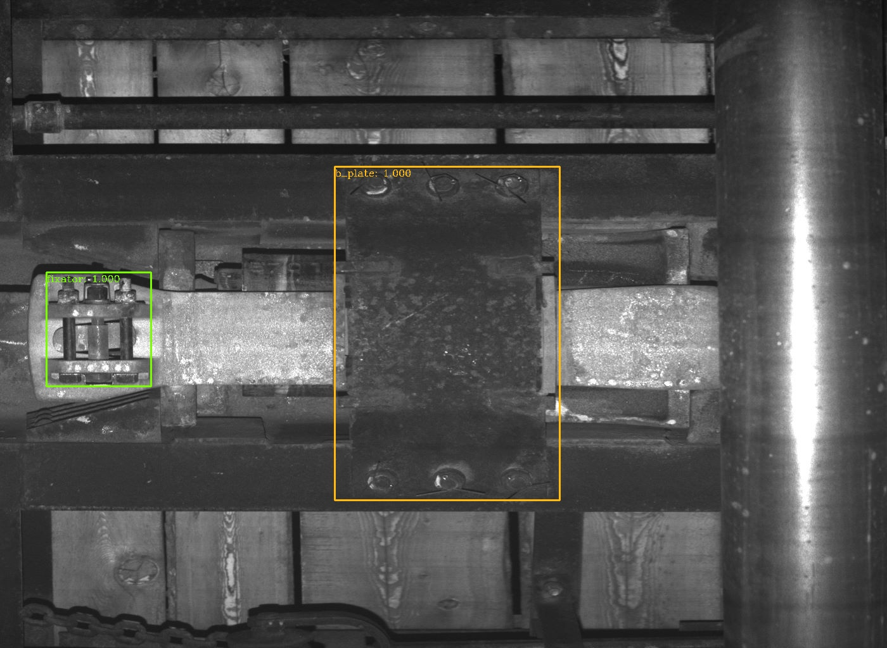
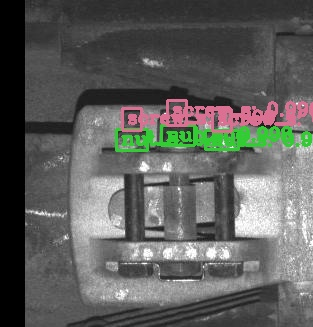
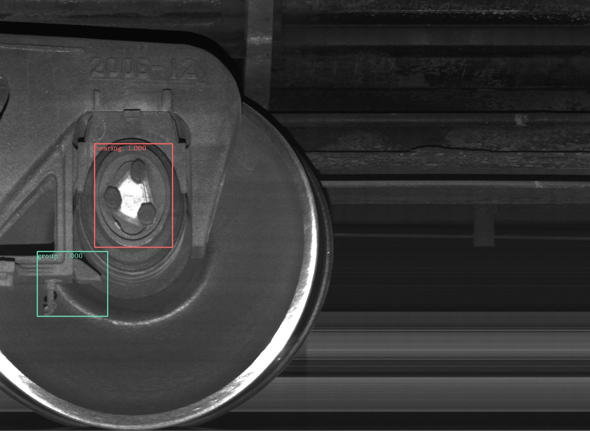
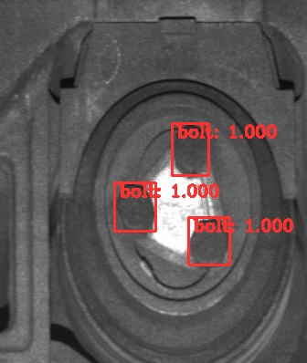
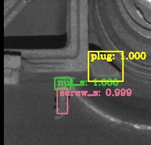
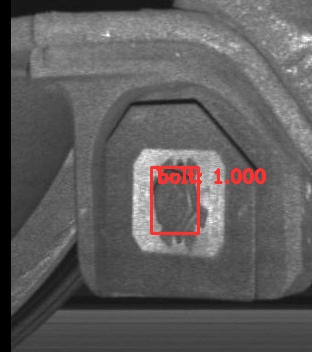
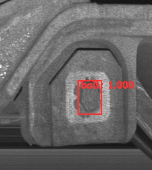

#  A Deep Learning based Framework for Component Defect Detection of Moving Trains

## Introduction

This is the code for the paper: A Deep Learning based Framework for Component Defect Detection of Moving Trains. We have implemented our methods in **PyTorch**.

## Preparation

First of all, clone the code
```
git clone https://github.com/smartprobe/Train_Defect_Detection.git
```

Then, create a folder:
```
cd Train_Defect_Detection/stage1 && mkdir data
```

Install all the python dependencies using pip:
```
pip install -r requirements.txt
```

Compile the cuda dependencies using following simple commands:
```
cd lib
sh make.sh
```

## Prerequisites

* Python 2.7
* Pytorch 0.4.0
* CUDA 8.0 or higher

## Data Preparation

~~* **PASCAL_VOC 07+12**: Please follow the instructions in [py-faster-rcnn](https://github.com/rbgirshick/py-faster-rcnn#beyond-the-demo-installation-for-training-and-testing-models) to prepare VOC datasets. Actually, you can refer to any others. After downloading the data, creat softlinks in the folder data/.~~

## Pretrained Model

We used two pretrained models in our experiments, VGG and ResNet101. You can download these pre-trained models from:

* ResNet101: [Google Drive](https://drive.google.com/open?id=1v6oxLMeUWM1HYh6ThhNkmvq1nAZNoUPK)

Download them and put them into the data/pretrained_model/.

## Train

Before training, set the right directory to save and load the trained models. Change the arguments "save_dir" and "load_dir" in trainval_net.py and test_net.py to adapt to your environment.

To train a faster R-CNN model with resnet101 on pascal_voc, simply run:
```
CUDA_VISIBLE_DEVICES=$GPU_ID python trainval_net.py \
                   --dataset pascal_voc --net res101 \
                   --bs $BATCH_SIZE --nw $WORKER_NUMBER \
                   --lr $LEARNING_RATE --lr_decay_step $DECAY_STEP \
                   --cuda
```

## Test

If you want to evlauate the detection performance , simply run
```
python test_net.py --dataset pascal_voc --net res101 \
                   --checksession $SESSION --checkepoch $EPOCH --checkpoint $CHECKPOINT \
                   --cuda --vis
```
Specify the specific model session, chechepoch and checkpoint, e.g., SESSION=1, EPOCH=20, CHECKPOINT=1000.

We have trained the two model for testing our dataset.

* Stage1:  [Google Drive](https://drive.google.com/open?id=151499FF5oN8jHKclp693tHIonic5JuV7)

* Stage2:  [Google Drive](https://drive.google.com/open?id=1b2VuFeIjO8klsvdHJ_DUJzq-Hcimkrls)


## Implementation

* Stage1: 
(Input is the original images, Output is the bounding box and the cropped patches)
```
cd ./stage1/
1.run test_net.py as mentioned above
2.generate bounding boxes in Images and saved in ./results
3.generate patches in ./crop_images
```


* Stage2: 
(Input is the cropped patches from stage1, Output is the bounding box)
```
cd ./stage2/
1.The input is the patches generated in stage1.
2.run demo.py as mentioned above
3.generate bounding boxes in Images and saved in ./demo
```


## Sample of our method

* Sample 1:


* Sample 1:



   

* Sample 2:



  

* Sample 3:



   

* Sample 4:


  
