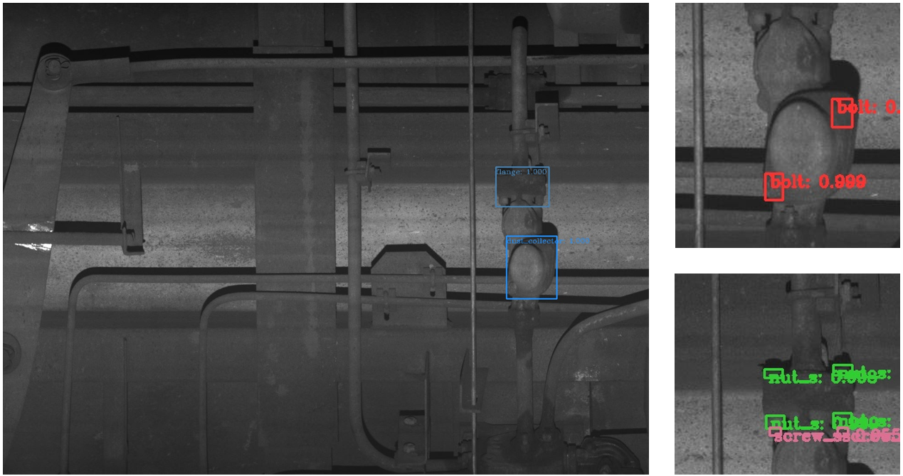
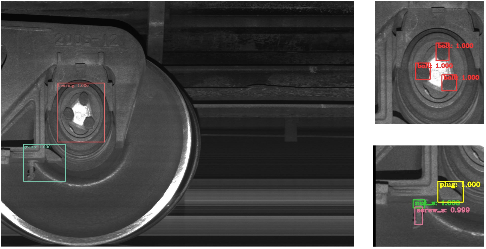
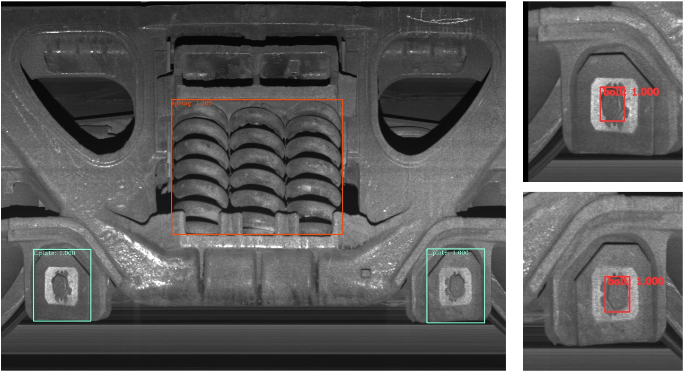

#  A Deep Learning based Framework for Component Defect Detection of Moving Trains

## Introduction

This is the code for the paper: A Deep Learning based Framework for Component Defect Detection of Moving Trains. We have implemented our methods in **PyTorch**.

## Preparation

First of all, clone the code
```
git clone https://github.com/smartprobe/Train_Defect_Detection.git
```

Install all the python dependencies using pip:
```
pip install -r requirements.txt
```

Compile the cuda dependencies using following simple commands:
```
cd lib
sh make.sh
```

## Prerequisites

* Python 2.7
* Pytorch 0.4.0
* CUDA 8.0 or higher

## Pretrained Model

We used the pretrained models in our experiments. You can download these pre-trained models from:

* ResNet101: [Google Drive](https://drive.google.com/open?id=1v6oxLMeUWM1HYh6ThhNkmvq1nAZNoUPK)

Download it and put it into the directory: branch1/data/pretrained_model/ and branch2/data/pretrained_model

## Train

Before training, set the right directory to save and load the trained models. Change the arguments "save_dir" and "load_dir" in trainval_net.py and test_net.py to adapt to your environment.

To train a faster R-CNN model with resnet101 on pascal_voc, simply run:
```
CUDA_VISIBLE_DEVICES=$GPU_ID python trainval_net.py \
                   --dataset pascal_voc --net res101 \
                   --bs $BATCH_SIZE --nw $WORKER_NUMBER \
                   --lr $LEARNING_RATE --lr_decay_step $DECAY_STEP \
                   --cuda
```

## Test

If you want to evlauate the detection performance and generate bounding boxes in images and patches, simply run
```
python test_net.py --dataset pascal_voc --net res101 \
                   --checksession $SESSION --checkepoch $EPOCH --checkpoint $CHECKPOINT \
                   --cuda --vis
```
Specify the specific model session, chechepoch and checkpoint, e.g., SESSION=1, EPOCH=20, CHECKPOINT=1000.

## Demo

If you want to generate bounding boxes in images only, simply run
```
python demo.py --net res101 \
               --checksession $SESSION --checkepoch $EPOCH --checkpoint $CHECKPOINT \
               --cuda
```
Specify the specific model session, chechepoch and checkpoint, e.g., SESSION=1, EPOCH=20, CHECKPOINT=1000.

## Implementation

We have trained the two model for testing our dataset.

* Branch 1:  [Google Drive](https://drive.google.com/open?id=151499FF5oN8jHKclp693tHIonic5JuV7)

Download it and put it into the directory: branch1/models/res101/pascal_voc

* Branch 2:  [Google Drive](https://drive.google.com/open?id=1b2VuFeIjO8klsvdHJ_DUJzq-Hcimkrls)

Download it and put it into the directory: branch2/models/res101/pascal_voc


* Branch 1: 
(Input is the original images, Output is the bounding box and the cropped patches)
```
cd ./branch1
1.Run test_net.py as mentioned above. The input directory is: ./branch1/data
2.Generate bounding boxes in images and saved in: ./branch1/demo_output
3.Generate patches and saved in: ./branch1/crop_images
```

*  Branch 2: 
(Input is the cropped patches from Branch 1, Output is the bounding box)
```
cd ./branch2
1.Run demo.py as mentioned above. The input directory is: ./branch1/crop_images
2.Generate bounding boxes in images and saved in: ./branch2/demo_output
```


## Samples of our method

* Sample 1:



* Sample 2:



* Sample 3:



